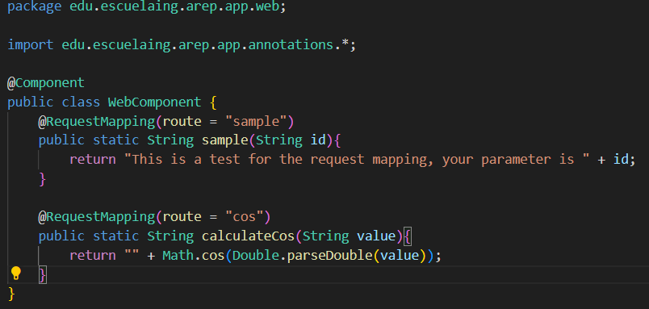
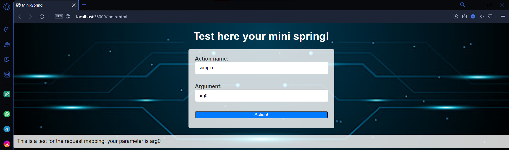
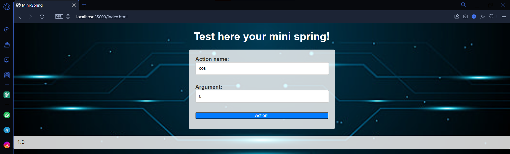

# MINI SPRING ANNOTATIONS (TALLER 4 AREP)

Taller 4 del curso de Arquitecturas Empresariales (AREP) en el que se implementa un framework de estilo SpringBoot basado en anotaciones para mapear rutas del navegador y así implementar servicios API REST de manera mucho más dinamica y sencilla.

## Diseño
Este proyecto funciona y esta organizado en diferentes componentes con responsabilidades unicas.

1. `HTTPResponse` Componente clave encargado de formar, mapear y retornar los diferentes encabezados, códigos de respuesta y contenido del cuerpo de los mensajes HTTP. Se trata de una clase auxiliar.
2. `HTTPServer` componente encargado de administrar el servicio HTTP y de atender las solicitudes de conexión de los clientes. Además, administra un sistema API que consume el front.
3. `Annotations` Existen dos anotaciones principales:
- *`@Component`* Esta anotación marca a todas aquellas clases que serviran de componentes para el servidor web, contienen métodos para responder a rutas especificas.
- *`@RequestMapping`* Anotación que señala que métodos ofrecen servicios particulares bajo una ruta seleccionada. La ruta a la que sirven debe ser señalada bajo el parametro `route`
4. `ReflexiveManager` componente principal del proyecto encargado de buscar dentro del directorio *target/Classes* todas aquellas clases que tengan la anotación *`@Component`* y así ejecutar de manera selectiva métodos asociados a rutas. Dichos métodos son extraidos al ser señalados con la anotación *`@RequestMapping`* y la ruta en la que ofrecen sus servicios.
5. `WebComponent` Se trata de un componente para pruebas, este posee la anotación *`@Component`* y sus méotodos estan asociados con la anotación *`@RequestMapping`*. Si lo desea, en esta clase se pueden escribir métodos de prueba para probar funcionalidades para el servidor web.

## Extensión e implementación de otros servicios

Aún existen algunas funcionalidades a tener en cuenta para futuras versiones de este proyecto:

1. El componente encargado de generar encabezados puede extenderse para agregar aún más códigos de respuesta a diferencia de los que se encuentran actualmente (200 y 404) esto con el fin de cubrir todos los espectros de prueba que el usuario pueda generar.

2. El factor de lectura y envio de datos del servidor es perfectamente funcional, la página web podría aprovechar esta ventaja para implementar aún más recursos multimedia, tal como video y demás elementos audiovisuales.

3. Podría implementarse un servicio de subida de imagenes para alimentar la galeria con más datos ofreciendo más posibilidades de consumo dentro del proyecto.

4. El framework esta limitado a realizar operaciones GET por medio de las anotaciones, se podrían crear aún más interfaces de este estilo para atender todo tipo de solicitudes como POST (*`@PostMapping`*) y PUT (*`@PutMapping`*).

5. De momento esta solución solo permite usar un nivel de rutas URL para ello (`/accion`), mientras que una solución mucho más robusta podría definir sub rutas para servicios más especificos (`/users/create`).

## Instrucciones de uso

### Pre-requisitos

Antes de ejecutar el servidor es necesario contar con los siguientes programas instalados y funcionando:

1. JDK (Java Development Kit)
2. MVN (Maven)

### Instalación y Ejecución

A continuación se muestra el paso a paso de como instalar y ejecutar el servidor HTTP

1. Clone este repositorio localmente en un entorno o carpeta de trabajo.

```
$ git clone https://github.com/NickArB/AREP-TALLER-4.git
```

2. Dentro del entorno o directorio en el que clono el proyecto, asegurese de que no existan ejecutables previos o no deseados con maven.

```
$ mvn clean
```
3. Una vez que los targets han sido descartados compilelos y re asignelos al target.
```
$ mvn package
```
4. Con los target asignados, ejecute el metodo main de la clase `HTTPServer.java`. Dependiendo de su IDE esta clase se puede ejecutar de varias formas, en caso de no tener un IDE se recomienda el uso del siguiente comando
```
$ mvn exec:java -"Dexec.mainClass"="edu.escuelaing.arep.app.server.HTTPServer"
```
5. Una vez el servicio esta corriendo puede verificar que esta funcionando al escribir la ruta en el navegador
```
http://localhost:35000/index.html
```


Dentro de WebComponent se encuentran dos métodos que reciben peticiones dentro de las rutas "sample" y "cos" respectivamente.



Prueba para la ruta `sample`



Prueba para la ruta `cos`




## Construido con

* [Maven](https://maven.apache.org/) - Manejo de dependencias

## Version 1.0

## Autor

* **Nicolás Ariza Barbosa**

<!-- javadoc -d doc -sourcepath src/main/java -subpackages edu.escuelaing.app.taller -->
